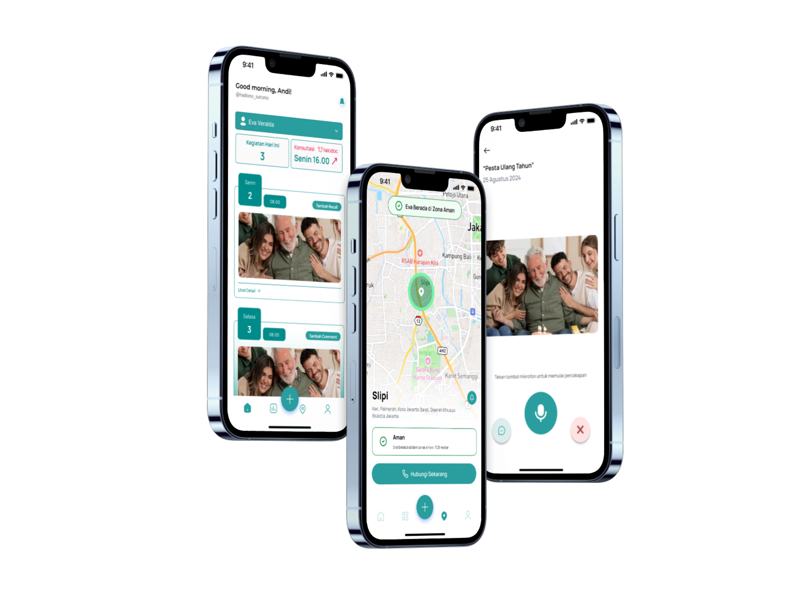

<h1 align="center">Cognivia - Smart Companion for Dementia Care</h1> 

<p align="center">
  Empowering dementia patients and caregivers through AI-powered tools
</p>

<p align="center">
  <a href="#tech-stack"><strong>Tech Stack</strong></a> ·
  <a href="#features"><strong>Features</strong></a> ·
  <a href="#apk"><strong>APK</strong></a> ·
  <a href="#microservice"><strong>Microservice</strong></a> ·
  <a href="#clone-and-run-locally"><strong>Clone and run locally</strong></a>
</p>

<br/>

## Tech Stack

### Frontend
- React Native
- Typescript
- Tailwind CSS (NativeWind)
- Expo

### Backend & Services
- Supabase (Database & Auth)
- AWS S3 (Storage)
- Python (Telegram Microservice)

### AI & ML
- Gemini API (Speech Recognition, Context Generation)
- ElevenLabs (Text-to-Speech)
- React Native ML Kit (Text Recognition)

### Map
- Google Maps API (Real-Time Location)

---

## Features

- **Recall Memory** — Speech-to-text & text-to-speech to help patients recall info
- **Guess Me** — Face recognition using ML Kit to identify familiar people
- **Clock Test** — Interactive cognitive test for dementia screening
- **AI Agent** — Sends media files to caregivers via Telegram
- **Safe Zone** — Real-time location tracking with Google Maps
- **Secure User Data** — Stored and authenticated with Supabase

---

## APK

Akses APK melalui tag release di sini:  
**[Download APK](https://github.com/user-attachments/assets/92fa1da4-998f-4db5-a64e-8548e229f570)**

---

## Microservice

Kami juga mengembangkan microservice tambahan untuk integrasi Telegram Bot.  
Cek source code-nya di:  
**[cognivia-telegram-bot](https://github.com/valuin/cognivia-telegram-bot)**

---

## Clone and run locally

1. Clone repository ini:

```bash
git clone https://github.com/namauser/cognivia.git
cd cognivia
